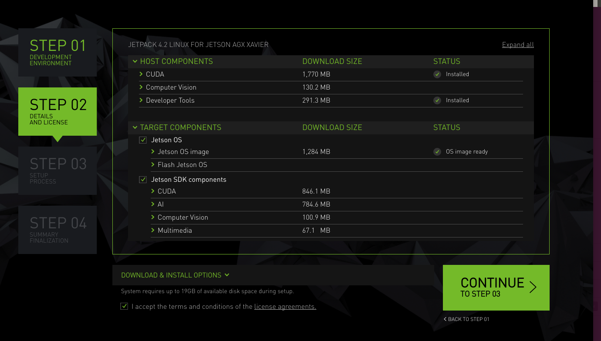
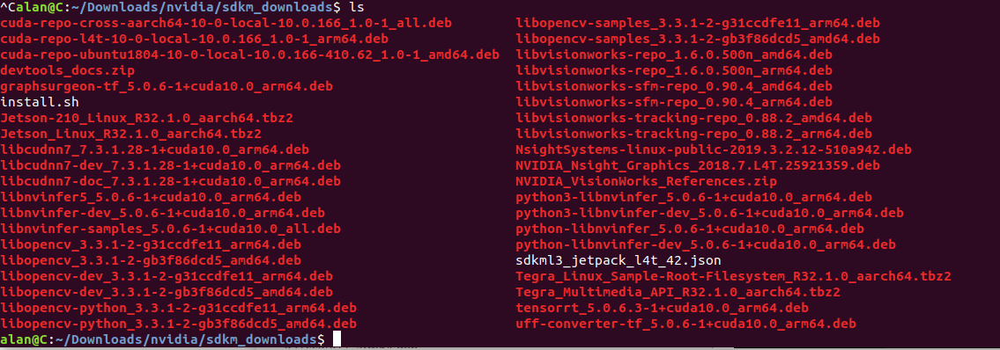
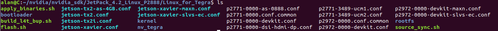

# Jetpack
###Install the jetpack and flash the jetson board offline
Note: This document help those guys who never flashed the board sucessfully with Jetpack or sdkmanager tools. If the tools works well pls SKIP to the end.

***
Tuesday, 16. April 2019 02:57PM 

- Run [sdkmanager](https://developer.nvidia.com/embedded/downloads)  or [JetPack](https://developer.nvidia.com/embedded/downloads) from Jetson Download Center.

-  Choose whatever you want to install. Accept the license agreements.

 . Then continue 
	
- OK, you are failed to flash the board but you have got everything you need. let's workarount it.

You can see the file which need to be installed are all under this folder. In case you are using sdkmanger. The rootfs are locate under "~/nvidia/nvidia_sdk/JetPack_4.2_Linux_P2888/Linux_for_Tegra$"

- Try to chroot to jetson roofs to cross install all the package you need. Now you are under "~/nvidia/nvidia_sdk/JetPack_4.2_Linux_P2888/Linux_for_Tegra"

On X86 Host:

		sudo cp /etc/resolv.conf rootfs/etc/
		sudo cp qemu-aarch64-static rootfs/usr/bin/
		sudo cp -rf ~/Downloads/nvidia/sdkm_downloads/ rootfs/
		sudo cp install.sh rootfs/sdkm_downloads
		sudo bash ch-mount.sh -m rootfs
	
Now you are under rootfs. Let's install all the package.

		cd sdkm_downloads && bash install.sh
		apt update && apt install -f
		exit

Exit the rootfs. Now you are returned to X86 Host.

		sudo bash ch-mount.sh -u rootfs
		sudo rm rootfs/usr/bin/qemu-aarch64-static
		sudo rm rootfs/sdkm_downloads -rf

- Now let's begin to flash the jetson board. Fist put the Xavier to recover mode. 
Note: the usb-type-c used for flash the board should be close to the led. Do not use the one close to the dc input. Check with comman:

		lsusb
You'll get:

		Bus 002 Device 015: ID 0955:7020 NVidia Corp. 
		sudo ./apply_binaries.sh
		sudo ./flash.sh jetson-xavier mmcblk0p1

	For TX2: 

		sudo ./flash.sh jetson-tx2 mmcblk0p1
		
After about 30min there will be a pop-up window to notice you to setup. After that every is ready. Next flash cycle, just run the last command.